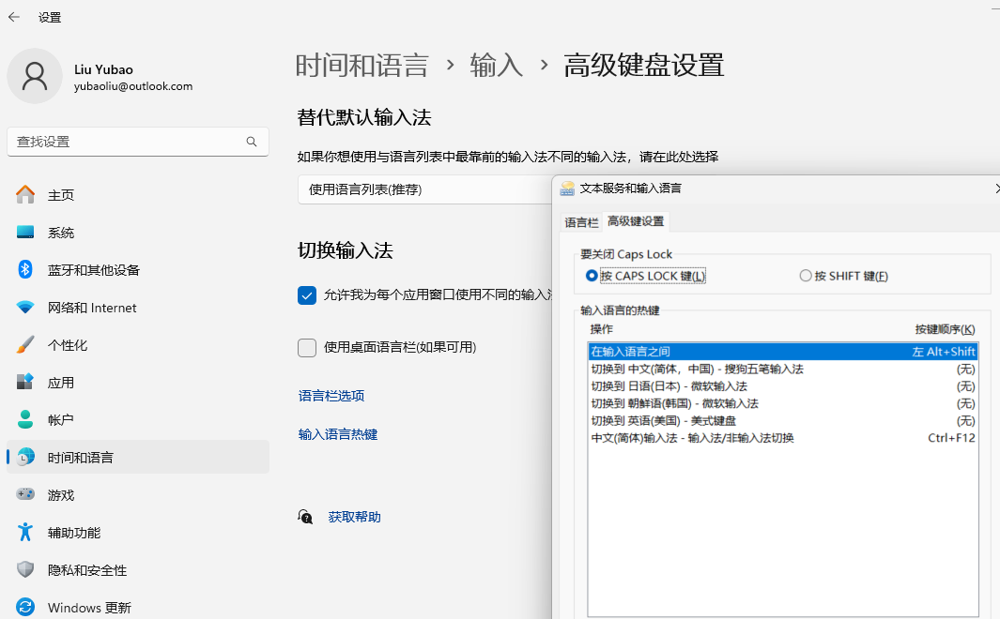
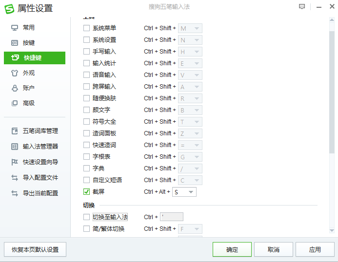

[TOC]

# Synopsys

This is my awesome configure file for Ubuntu, Windows and Mac.

# Shortcut

##  Windows

|                   | Default Key      | Key              | Note                                                         |
| ----------------- | ---------------- | ---------------- | ------------------------------------------------------------ |
| **搜狗输入法**    |                  |                  | 前缀 Ctrl+ Shift                                             |
| 搜狗截屏          | Ctrl + Alt +  Q  | Ctrl + Alt +  s  |                                                              |
| 输入法切换        |                  | Alt  + Shift     | Sogou五笔                                                    |
|                   |                  |                  |                                                              |
| **Windows 系统**  |                  |                  |                                                              |
| 分屏              |                  | Win +  Arrows    | 鼠标拖拽分屏. 用鼠标左键按住一个窗口的顶端处，接着拖拽到桌面的边上 |
| 多桌面            |                  | Win + Tab        |                                                              |
|                   |                  |                  |                                                              |
| 系统列表          |                  | Win + x          |                                                              |
| 关闭TAB           |                  | Alt + F4         |                                                              |
| Toggle Fullscreen |                  | F11              |                                                              |
| Find              | Ctrl + shitf + F | Alt + shift +F   |                                                              |
|                   |                  |                  |                                                              |
| **Power Shell**   |                  |                  | 配置文件: \$PROFILE                                          |
| **Pane**          |                  |                  |                                                              |
| split down        |                  | Alt + Shift + -  |                                                              |
| split right       |                  | Alt + Shift + \| |                                                              |
| Move focus        |                  | Alt + Arrow      |                                                              |
| Close pane        |                  | Alt + Shit + c   |                                                              |
| **Tab**           |                  |                  |                                                              |
| New  tab          |                  | Alt + Shit + t   |                                                              |
| Next tab          |                  | Alt + Shift + n  |                                                              |
| Previous tab      |                  | Alt + shift + p  |                                                              |
|                   |                  |                  |                                                              |
|                   |                  |                  |                                                              |
|                   |                  |                  |                                                              |

- Windows输入法

    

- 搜狗输入法

    

## VIM

- Install Plug for Linux

    ```sh
    curl -fLo ~/.vim/autoload/plug.vim --create-dirs \
    https://raw.githubusercontent.com/junegunn/vim-plug/master/plug.vim
    ```

- Install plug for Windows

    ```
    iwr -useb https://raw.githubusercontent.com/junegunn/vim-plug/master/plug.vim |` ni \$HOME/vimfiles/autoload/plug.vim -Force
    ```


|                            | Old Key          | Key                           |  |
|----------------------------|------------------|-------------------------------|--|
| 重新加载                   | :source ~/.vimrc |                               |  |
|                            |                  |                               |  |
| **Basics**                 |                  |                               |  |
| write changes              | ww               |                               |  |
| write without modification | w!               |                               |  |
| write and quit             | wq               |                               |  |
| quit without write         | q!               |                               |  |
| quit all the windows       | qall             |                               |  |
|                            |                  |                               |  |
| **NERDTree**               |                  |                               |  |
| 打开目录树                 | :NERDTree        | F2                            |  |
| 关闭目录树                 | :NERDTreeClose   |                               |  |
| 打开/关闭目录树            | :NERDTreeToggle  |                               |  |
| 打开目录树并定位到当前文件 | :NERDTreeFind    |                               |  |
|                            |                  |                               |  |
| **Function keys**          |                  |                               |  |
| undo tree                  |                  |                               |  |
| autoformat                 |                  | F3                            |  |
| markdown preview           |                  | mp                            |  |
| stop markdown preview      |                  | ms                            |  |
|                            |                  |                               |  |
| **Window**                 |                  |                               |  |
| new  window                | c                |                               |  |
| close all other windows    | wo               |                               |  |
| vertical window            | \|               |                               |  |
| vertical window            | -                |                               |  |
|                            |                  |                               |  |
| **Jump**                   |                  |                               |  |
| Jump to a subject          |                  | Ctrl - ]                      |  |
| Jump back                  |                  | g<RightMouse>, <C-RightMouse> |  |
| Repeat to go back          |                  | Ctrl-O                        |  |
|                            |                  |                               |  |
| **Markdown**               |                  |                               |  |
| Mark Drawer                | :MarkDrawer      | md                            |  |
|                            |                  |                               |  |


## Tmux

|        | Original Key | Key   | Notes |
| ------ | ------------ | ----- | ----- |
| Prefix |              | <C-b> |       |
|        |              |       |       |
|        |              |       |       |


# Installation

```sh
git clone git@github.com:yubaoliu/dotfiles.git ~/dotfiles

cd ~
ln -s dotfiles/.zshrc
ln -s dotfiles/.vimrc
```

*   Install the requirements

    ```sh
    ./install.sh
    ```

*   Deploy the configurations, this will delete the old configure in ~

    ```sh
    ./deploy.sh
    ```

*   Put your manually config to ~/local\_config.sh


# on-my-zsh

```sh
sudo apt install zsh
sh -c "$(wget -O- https://raw.githubusercontent.com/ohmyzsh/ohmyzsh/master/tools/install.sh)"
rm ~/.zshrc
```

# oh-my-posh
- [Oh My Posh](https://ohmyposh.dev/)

- https://ohmyposh.dev/docs/themes

- [教程 - 使用 Oh My Posh 为 PowerShell 或 WSL 设置自定义提示符](https://learn.microsoft.com/zh-cn/windows/terminal/tutorials/custom-prompt-setup)

- Powershell

    ```sh
    winget install JanDeDobbeleer.OhMyPosh
    oh-my-posh version
    winget upgrade oh-my-posh

    notepad $PROFILE
    ```

- Linux

    ```sh
    ## Install Oh my Posh (Method 1)
    curl -s https://ohmyposh.dev/install.sh | bash -s

    ## Install Oh my Posh (Method 2)
    sudo wget https://github.com/JanDeDobbeleer/oh-my-posh/releases/latest/download/posh-linux-amd64 -O /usr/local/bin/oh-my-posh

    sudo chmod +x /usr/local/bin/oh-my-posh

    ## Download the themes
    mkdir ~/.poshthemes
    wget https://github.com/JanDeDobbeleer/oh-my-posh/releases/latest/download/themes.zip -O ~/.poshthemes/themes.zip
    unzip ~/.poshthemes/themes.zip -d ~/.poshthemes
    chmod u+rw ~/.poshthemes/*.json
    rm ~/.poshthemes/themes.zip

    ## Change your prompt
    eval "$(oh-my-posh --init --shell bash --config ~/.{theme}.omp.json)"
    ```

# Oh-my-tmux

- https://github.com/gpakosz/.tmux
- https://github.com/pangliang/oh-my-tmux
- https://github.com/namtzigla/oh-my-tmux/tree/master

# oh my nvim

- https://github.com/hardhackerlabs/oh-my-nvim

# VIM

## Install

```sh
sudo add-apt-repository ppa:jonathonf/vim
```


## Vim Tutorials

VIM 常用的有四个模式，：

常模式 (Normal-mode)
插入模式 (Insert-mode)
命令模式 (Command-mode)
可视模式 (Visual-mode)

## Mode

```sh
:help map-modes
```

| 递归的映射 | 非递归映射 | 删除某个映射 |
| ---        | ---        | ---          |
| :map       | :noremap   | :unmap       | Normal, Visual, Select, Operator-pending
| :nmap      | :nnoremap  | :nunmap      | Normal
| :vmap      | :vnoremap  | :vunmap      | Visual and Select
| :smap      | :snoremap  | :sunmap      | Select
| :xmap      | :xnoremap  | :xunmap      | Visual
| :omap      | :onoremap  | :ounmap      | Operator-pending
| :map!      | :noremap!  | :unmap!      | Insert and Command-line
| :imap      | :inoremap  | :iunmap      | Insert
| :lmap      | :lnoremap  | :lunmap      | Insert, Command-line, Lang-Arg
| :cmap      | :cnoremap  | :cunmap      | Command-line
| :tmap      | :tnoremap  | :tunmap      | Terminal-Job

```sh
标记 模式
<space>　常规模式，可视化模式，运算符模式
n　　　　　常规模式
v　　　　　可视化模式
o　　　　　运算符模式
!　　　　　插入模式，命令行模式
i　　　　　插入模式
c　　　　　命令模式

- nore 表示非递归，见下面的介绍
    - n 表示在普通模式下生效
    - v 表示在可视模式下生效
    - i 表示在插入模式下生效
    - c 表示在命令行模式下生效
- map 表示递归的映射
- unmap 表示删除某个映射
- mapclear 表示清除映射
- ! 插入和命令行
- i 插入
- l 插入、命令行和 Lang-Arg 模式的 ":lmap" 映射
```


##   Help docs

- [Vim documentation: options](http://vimdoc.sourceforge.net/htmldoc/options.html)
Refresh config

## vim commands

- set paste

Reload .vimrc and `:PlugInstall` to install plugins.

**vim plugin commands**

| Command                             | Description                                                  |
| ----------------------------------- | ------------------------------------------------------------ |
| `PlugInstall [name ...] [#threads]` | Install plugins                                              |
| `PlugUpdate [name ...] [#threads]`  | Install or update plugins                                    |
| `PlugClean[!]`                      | Remove unlisted plugins (bang version will clean without prompt) |
| `PlugUpgrade`                       | Upgrade vim-plug itself                                      |
| `PlugStatus`                        | Check the status of plugins                                  |
| `PlugDiff`                          | Examine changes from the previous update and the pending changes |
| `PlugSnapshot[!] [output path]`     | Generate script for restoring the current snapshot of the plugins |

## NERD Commenter

*   [Official GitHub](https://github.com/preservim/nerdcommenter)

*   [NERD Commenterでコメントアウト、アンコメントを楽にする](https://qiita.com/pepo/items/09bacf98a36f6a7285ac)

*   help

    ```sh
    :help NERDCommenter命令查看帮助
    ```

*   map

    ```sh
    :map
    ```

    使用:map!命令，则只列出插入和命令行模式的映射。而:imap，:vmap，:omap，:nmap命令则只是列出相应模式下的映射。

*   Leader key: `\`
*   NERDCommenterToggle

    ```sh
    [count]<leader>c<space> |NERDCommenterToggle|
    ```

*   `[count]cc` **|NERDCommenterComment|**

    Comment out the current line or text selected in visual mode.

*   `[count]cn` **|NERDCommenterNested|**

    Same as cc but forces nesting.

*   `[count]c` **|NERDCommenterToggle|**

    Toggles the comment state of the selected line(s). If the topmost selected line is commented, all selected lines are uncommented and vice versa.

*   `[count]cm` **|NERDCommenterMinimal|**

    Comments the given lines using only one set of multipart delimiters.

*   `[count]ci` **|NERDCommenterInvert|**

    Toggles the comment state of the selected line(s) individually.

*   `[count]cs` **|NERDCommenterSexy|**

    Comments out the selected lines with a pretty block formatted layout.

*   `[count]cy` **|NERDCommenterYank|**

    Same as cc except that the commented line(s) are yanked first.

*   `c$` **|NERDCommenterToEOL|**

    Comments the current line from the cursor to the end of line.

*   `cA` **|NERDCommenterAppend|**

    Adds comment delimiters to the end of line and goes into insert mode between them.

*   **|NERDCommenterInsert|**

    Adds comment delimiters at the current cursor position and inserts between. Disabled by default.

*   `ca` **|NERDCommenterAltDelims|**

    Switches to the alternative set of delimiters.

*   `[count]cl` **|NERDCommenterAlignLeft** `[count]cb` **|NERDCommenterAlignBoth**

    Same as **|NERDCommenterComment|** except that the delimiters are aligned down the left side (`cl`) or both sides (`cb`).

*   `[count]cu` **|NERDCommenterUncomment|**

    Uncomments the selected line(s).

## vim-which-key

- [vim-which-key](https://github.com/liuchengxu/vim-which-key)

## vim-autoformat

*   [vim-autoformat](https://github.com/Chiel92/vim-autoformat)

*   <F3>: auto format

*   clang-format  for **C**, **C++**, **Objective-C**, **Protobuf** (

    既然有了clang-format，为什么还需要vim-autoformat呢？其实这里vim-autoformat是相当于将原本独立的clang-format集成到了vim中，没有它，也就只能单独运行clang-format来格式化代码

    在ubuntu下安装clang-format也非常的方便，只需运

    ```sh
    sudo apt-get install clang-format
    ```

*   astyle for **C#**, **C++**, **C** and **Java**.

    ```sh
    sudo apt-get install astyle
    ```

*   autopep8 for **Python** (supports formatting ranges)

    ```sh
    pip install autopep8
    yum -y install clang
    ```

*   autopep8 (**Python**)

    ```sh
    sudo apt-get install python-autopep8
    ```

*   yapf (**Python**)

    ```sh
    sudo pip install yapf or pip install --user yapf
    let g:formatter_yapf_style = 'pep8'
    ```

    pep8 is the default value, or you can choose: google, facebook, chromium.
    pep8 is the default value, or you can choose: google, facebook, chromium.

*   `black` for **Python**

    ```sh
    sudo pip install black
    or
    pip install --user
    ```

*   `remark` for **Markdown**
    ```sh
    sudo apt install remark
    ```

*   `fixjson` for JSON

    ```sh
    npm install -g remark-cli
    ```

## caw.vim

```sh
:help caw-keybindings
```

*   https://github.com/tyru/caw.vim
*   Refer from; https://yoheikoga.github.io/2017/04/12/caw-vim-comment-out-toggle-shortcut/

    ```sh
    .vimrc
    " 行の最初の文字の前にコメント文字をトグル
    nmap <Leader>c <Plug>(caw:hatpos:toggle)
    vmap <Leader>c <Plug>(caw:hatpos:toggle)
    " 行頭にコメントをトグル
    nmap <Leader>, <Plug>(caw:zeropos:toggle)
    vmap <Leader>, <Plug>(caw:zeropos:toggle)
    ```

## ycm


## coc.vim

vim >= 8.2 or neovim >= 0.5

```
Plug 'neoclide/coc.nvim', {'branch': 'release'}
```


## Keymap

查看快捷键绑定与冲突

例子：verbose map <F2>

# NVIM

```sh
sudo add-apt-repository ppa:neovim-ppa/stable
sudo apt-get update
sudo apt-get install neovim
```


# How To

- How to change shell

    ```sh
    sudo chsh -s $(which zsh)
    ```

# Commands

*   Command history

    *   C-r

    *   Un-share the history among terminals

        ```sh
        unsetopt share_history
        setopt no_share_history
        ```

*   mkcd

    ```sh
    echo -e "function mkcd(){mkdir -p \$1 && cd \$1}" >> ~/.zshrc && exec $SHELL
    ```

# Software

## TMUX

```sh
sudo apt-get install -y libevent-dev
libncurses5-dev libncursesw5-dev \
bison \
byacc \
autotools-dev \
automake


git clone https://github.com/tmux/tmux.git
cd tmux
sh autogen.sh
./configure && make
```

*   prefix: C-SPC

## tmuxinator

*   Dependence

    ```sh
    ruby --version
    ruby 2.6.5p114 (2019-10-01 revision 67812) [x86_64-linux-gnu]

    tmux -V
    tmux next-3.2
    ```

*   Install

    ```sh
    gem install --user-install tmuxinator

    # completion
    wget https://raw.githubusercontent.com/tmuxinator/tmuxinator/master/completion/tmuxinator.zsh -O /usr/local/share/zsh/site-functions/_tmuxinator

    ```

    <https://github.com/tmuxinator/tmuxinator>

*   How to use

    ```sh
    tmuxinator new demo
    ```

    ```sh
    source 'https://rubygems.org'
    group :development do
    gem 'guard-livereload'
    gem 'guard-bundler'
    end
    ```

    Then run bundle install again.

*   [Setting Up Terminator (Terminal ++)](https://coderwall.com/p/1pivpa/setting-up-terminator-terminal)

## Rupy

You should upgrade ruby by

```sh
➜  ~ ruby --version
ruby 2.3.1p112 (2016-04-26) [x86_64-linux-gnu]
sudo apt autoremove ruby2.3*
```

```sh
sudo apt-add-repository ppa:brightbox/ruby-ng
sudo apt install ruby2.6 ruby2.6-dev

$ sudo gem install bundler
$ gem install bundler --user-install
```

The best solution:

https://stackoverflow.com/questions/37720892/you-dont-have-write-permissions-for-the-var-lib-gems-2-3-0-directory

1.  First, update the packages index and install the packages required for the ruby-build tool to build Ruby from source:

```sh
sudo apt-get remove ruby
sudo apt update
sudo apt install git curl libssl-dev libreadline-dev zlib1g-dev autoconf bison build-essential libyaml-dev libreadline-dev libncurses5-dev libffi-dev libgdbm-dev
```

2.  Next, run the following curl command to install both rbenv and ruby-build:

```sh
curl -sL https://github.com/rbenv/rbenv-installer/raw/master/bin/rbenv-installer | bash -
```

3.  Add $HOME/.rbenv/bin to the system PATH

```sh
echo 'export PATH="$HOME/.rbenv/bin:$PATH"' >> ~/.zshrc
echo 'eval "$(rbenv init -)"' >> ~/.zshrc
source ~/.zshrc
```

4.  Install the latest stable version of Ruby and set it as a default version with:

```sh
rbenv install 2.6.0
rbenv global 2.6.0
```

5.  Verify that Ruby was properly installed by printing out the version number:
```sh
ruby -v
```

**Install rubygems:**

sudo apt-get install rubygems

Not using root:

```sh
chown -R rubyusername:rubyusername /var/lib/gems
```

## rmtrash

```sh
sudo apt install trash-cli

# optional
sudo cp rmtrash/rmtrash /usr/local/bin
sudo cp rmtrash/rmdirtrash /usr/local/bin
```

*   https://github.com/PhrozenByte/rmtrash

## ROS

http://wiki.ros.org/kinetic/Installation/Ubuntu

```sh
sudo sh -c 'echo "deb http://packages.ros.org/ros/ubuntu $(lsb_release -sc) main" > /etc/apt/sources.list.d/ros-latest.list'
sudo apt-key adv --keyserver 'hkp://keyserver.ubuntu.com:80' --recv-key C1CF6E31E6BADE8868B172B4F42ED6FBAB17C654
sudo apt-get update
sudo apt-get install ros-kinetic-desktop-full

sudo rosdep init
rosdep update

sudo apt install python-rosinstall python-rosinstall-generator python-wstool build-essential

```

## Jekyll

*   Dependences
    *   ruby

        ```sh
        gem install bundler jekyll

        sudo apt-get install ruby-full build-essential zlib1g-dev
        gem install jekyll bundler

        bundle install
        bundle exec jekyll serve

        gem install jekyll-paginate

        # run
        jekyll serve --incremental
        ```

        Issue

        ```sh
        /usr/lib/ruby/vendor_ruby/rubygems/defaults/operating_system.rb:10: warning: constant Gem::ConfigMap is deprecated
        ```

        **Themes**

*   http://themes.jekyllrc.org/
    *

## Atom

-   markdown-writer
-   markdown-img-paste
    -   [sm.ms](https://sm.ms/login)
    *   qiniu
    *   assets folder


# Emacs

*   mark: C-c C-SPC

    Mehtod 1:

    ```sh
    sudo add-apt-repository ppa:kelleyk/emacs
    sudo apt install emacs26
    ```

    Method 2:

    ```sh
    sudo add-apt-repository ppa:ubuntu-elisp/ppa
    sudo apt-get update
    sudo apt-get install emacs-snapshot
    ```

# Ubuntu

```sh
sudo apt intall htop
```


# Windows


## Windows

- 家庭版 转 专业版

    ```sh
    irm massgrave.dev/get | iex
    ```
    Extra

## microKMS

- https://ilvruan.com
- http://www.yishimei.cn/

## 重置网络

Windows+X选择以管理员方式运行后输入netsh winsock reset 命令，重启计算机后看下效果

## Powershell

```sh
Install-Module [moudel name] -Scope CurrentUser # 只为当前用户安装

Install-Module git-aliases -AllowColbber

Install-Module posh-git
Install-Module oh-my-posh

```

- 假设出现`在此系统上禁止运行脚本`的问题，那么需要在shell中执行一下：

    ```sh
    Set-ExecutionPolicy remotesigned
    ```


## Tools

- Snipaste
    -

# Reference

*   spacemacs
*   [emacs派のためのvimrc](https://qiita.com/jimpei/items/c97e2bc06cabf1ffc07f)
*   [Markdown Style Guide](https://cirosantilli.com/markdown-style-guide/#tables)
*   [Windows PowerShell 美化记录](https://blog.tcs-y.com/2021/05/24/windows-powershell-beautify/#:~:text=%E6%B0%B4%E5%B9%B3%E5%88%86%E5%B1%8Falt%20%2B%20shift,shift%20%2B%20%2B%20(%E5%8A%A0%E5%8F%B7))

*   [VimForCpp](https://gitee.com/HGtz2222/VimForCpp#%E6%94%AF%E6%8C%81%E7%8E%AF%E5%A2%83)
*   [SpaceVim](https://spacevim.org/use-vim-as-a-c-cpp-ide/)

*   [oh-my-vim](https://github.com/liangxianzhe/oh-my-vim)

*   https://github.com/mzlogin/config-files

- [Linux-Set-up](https://manyyack.github.io/Linux-Set-up/)
- https://www.bookstack.cn/books/learn-vim
- [How to Setup Oh my Posh On Ubuntu](https://calebschoepp.com/blog/2021/how-to-setup-oh-my-posh-on-ubuntu/)

- [PowerVim](https://github.com/youngyangyang04/PowerVim)
- https://github.com/junegunn/vim-plug
- [终于把 vim 弄成了 vscode 的模样](https://itsuki.cn/blog/skcode-readme)
- [VSCodeVim-zh_cn](https://github.com/ugvibib/VSCodeVim-zh_cn)

